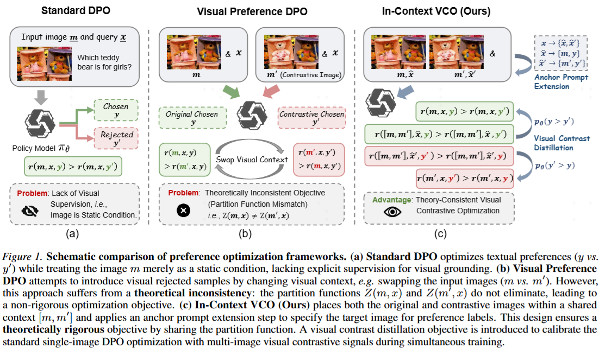

# [ICML 2026] Learning from Fine-Grained Visual Discrepancies: Mitigating Multimodal Hallucinations via In-Context Visual Contrastive Optimization

<p align="center">
  <a href="https://arxiv.org/abs/2605.31312">
    
  </a>
   
  <a href="https://github.com/OPPO-Mente-Lab/IC-VCO">
    
  </a>
   
  <a href="https://huggingface.co/datasets/OPPOer/IC-VCO-Dataset">
    
  </a>
</p>

Multimodal hallucination remains a persistent challenge for Vision-Language Models (VLMs). Standard textual Direct Preference Optimization (DPO) often fails to mitigate it due to a lack of explicit visual supervision. While existing works introduce visual preference DPO by contrasting original images against negative ones, they suffer from a theoretically inconsistent objective caused by partition function mismatches and rely on coarse-grained negatives that could enable shortcut learning. In this work, we propose In-Context Visual Contrastive Optimization (IC-VCO). By placing contrastive images within a shared multi-image context, IC-VCO ensures a mathematically rigorous objective. We further introduce Visual Contrast Distillation (VCDist), an auxiliary reliability-gated regularizer that encourages consistency between multi-image contrastive training and single-image inference. Finally, we propose a contrastive sample editing strategy that generates hard negatives via precise semantic perturbations. Experiments on five benchmarks demonstrate IC-VCO's best overall performance and the effectiveness of our sample editing strategy.



## Repository Layout

- `src/icvco/`: dataset loading, training, checkpoint merging, and evaluation-result aggregation.
- `scripts/train.sh`: end-to-end training.
- `scripts/eval.sh`: VLMEvalKit evaluation wrapper.
- `configs/accelerate/deepspeed_zero2.yaml`: single-node 8-GPU DeepSpeed ZeRO-2 config.
- `configs/datasets/registry.json`: dataset package metadata.
- `third_party/vlmevalkit/`: patches for a user-managed VLMEvalKit checkout.

## 1. Install Dependencies

Create and activate a Python environment, then install IC-VCO from this directory:

```bash
cd IC-VCO/

conda create -n icvco python=3.10 -y
conda activate icvco

python -m pip install --upgrade pip
python -m pip install -e ".[dev,train-extra]"
```

Core versions are recorded in `pyproject.toml`, including:

- `torch==2.7.1`
- `transformers==4.57.1`
- `trl==0.26.0`
- `peft==0.18.1`
- `accelerate==1.11.0`

Install the PyTorch CUDA wheel that matches your CUDA runtime if your platform
does not resolve the correct wheel automatically.

## 2. Download Dataset

Download the Hugging Face dataset repository into the IC-VCO repository root:

```bash
cd IC-VCO/

hf download OPPOer/IC-VCO-Dataset \
  --repo-type dataset \
  --local-dir IC-VCO-Dataset
```

The resulting directory should be:

```text
IC-VCO/
  IC-VCO-Dataset/
    README.md
    images/
    sft/train/metadata.parquet
    preference/train/metadata.parquet
```

`scripts/train.sh` uses this directory by default, equivalent to
`--dataset IC-VCO-Dataset`.

## 3. Configure VLMEvalKit

IC-VCO evaluation uses VLMEvalKit in config mode. Clone VLMEvalKit next to this
directory, check out the tested commit, and apply the IC-VCO patches:

```bash
cd IC-VCO/

git clone https://github.com/open-compass/VLMEvalKit.git
git -C VLMEvalKit checkout 58fdeb6b980bda22096d912d70d1c858dedc84fd

bash third_party/vlmevalkit/apply_patches.sh VLMEvalKit check
bash third_party/vlmevalkit/apply_patches.sh VLMEvalKit
```

Install the patched checkout in the same environment:

```bash
python -m pip install -e ./VLMEvalKit
```

The patch bundle updates LLaVA loading, config-mode generation kwargs, CRPE
path handling, and Y/N judge retry temperatures.

## 4. Fill `.env`

The shell scripts automatically load `opensource/.env` when it exists. Create
or edit it before running evaluation:

```dotenv
VLMEVALKIT_ROOT=IC-VCO//VLMEvalKit
LMUData=/path/to/vlmeval_benchmarks

API_BASE=https://dashscope.aliyuncs.com/compatible-mode/v1/chat/completions
API_KEY=<your-dashscope-key>
```

## 5. Train with LLaVA-NeXT-Interleave

`scripts/train.sh` runs SFT, merges the SFT LoRA checkpoint, and then runs
IC-VCO preference training. It assumes 8 visible GPUs by default.

```bash
cd IC-VCO/

bash scripts/train.sh \
  --base-model llava-hf/llava-interleave-qwen-7b-hf \
  --output-root outputs/llava_interleave \
  --run-id icvco_llava_interleave
```

You can choose to merge LoRA checkpoint with:

```bash
python -m icvco.cli.merge_ckpt \
  --path outputs/llava_interleave/icvco_llava_interleave/icvco
```

## 6. Evaluate with VLMEvalKit

Run evaluation on the IC-VCO checkpoint:

```bash
cd IC-VCO/

bash scripts/eval.sh \
  --model-path outputs/llava_interleave/icvco_llava_interleave/icvco \
  --work-dir outputs/llava_interleave/icvco_llava_interleave/eval
```

`eval.sh` defaults to:

- model family: `llava-interleave`
- Y/N benchmarks: `HallusionBench AMBER`
- MCQ benchmarks: `CRPE_EXIST CRPE_RELATION R-Bench-Dis R-Bench-Ref BLINK`
- Y/N judge: `qwen-flash`
- MCQ judge: `exact_matching`
- `max_new_tokens=128`
- `api_nproc=4`
- one machine with `ICVCO_GPU_COUNT=8`

To evaluate a different checkpoint:

```bash
bash scripts/eval.sh \
  --model-path /path/to/checkpoint \
  --work-dir outputs/eval_custom
```

After evaluation, aggregate score files can be summarized with:

```bash
python -m icvco.cli.print_eval_result \
  --dirs outputs/llava_interleave/icvco_llava_interleave/eval/llava_next_interleave_7b \
  --labels icvco_llava_interleave \
  --roles final \
  --benchmarks HallusionBench AMBER CRPE_EXIST CRPE_RELATION R-Bench-Dis R-Bench-Ref BLINK \
  --output outputs/llava_interleave/icvco_llava_interleave/eval_summary_paper_main.csv \
  --table-format paper-main
```

## License

This project is licensed under the **Apache License 2.0** — see the [LICENSE](./LICENSE) file.

Copyright 2026 OPPO. All rights reserved.


## Acknowledgements

We gratefully acknowledge the open-source models, frameworks, and dataset that support this work:

- **Base models.** The released training recipes use [LLaVA-NeXT-Interleave-Qwen-7B](https://huggingface.co/llava-hf/llava-interleave-qwen-7b-hf) and [LLaVA-OneVision-Qwen2-7B](https://huggingface.co/llava-hf/llava-onevision-qwen2-7b-ov-hf) as base models.

- **Frameworks.** The training code is modified from source code of [Hugging Face TRL](https://github.com/huggingface/trl). The evaluation scripts rely on [VLMEvalKit](https://github.com/open-compass/VLMEvalKit).

- **Dataset.** The released [IC-VCO-Dataset](https://huggingface.co/datasets/OPPOer/IC-VCO-Dataset) uses the [SymMPO dataset](https://huggingface.co/datasets/iLearn-Lab/NeurIPS25-SymMPO) as its seed corpus. 


## Citation

If you find this work helpful, please consider citing our paper and leaving valuable stars.

```
@inproceedings{
deng2026learning,
title={Learning from Fine-Grained Visual Discrepancies: Mitigating Multimodal Hallucinations via In-Context Visual Contrastive Optimization},
author={Haolin Deng and Xin Zou and Zhiwei Jin and Chen Chen and Haonan Lu and Xuming Hu},
booktitle={Forty-third International Conference on Machine Learning},
year={2026},
url={https://openreview.net/forum?id=dtHEthIjmu}
}
```
